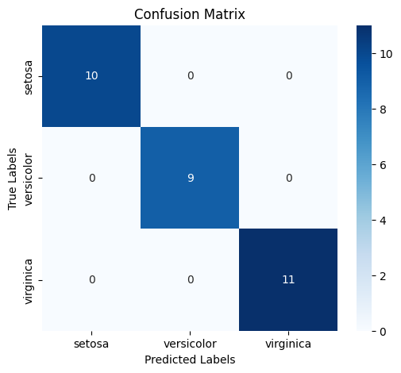
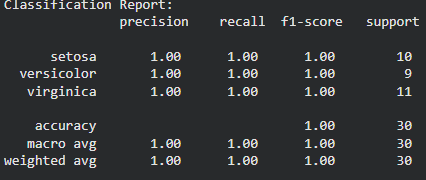
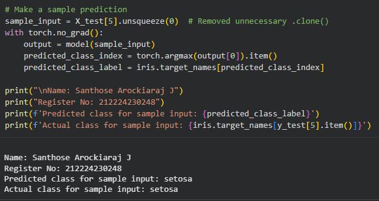

# Developing a Neural Network Classification Model

## AIM
To develop a neural network classification model for the given dataset.

## THEORY
The Iris dataset consists of 150 samples from three species of iris flowers (Iris setosa, Iris versicolor, and Iris virginica). Each sample has four features: sepal length, sepal width, petal length, and petal width. The goal is to build a neural network model that can classify a given iris flower into one of these three species based on the provided features.

## Neural Network Model
## Neural Network Model


## DESIGN STEPS
### STEP 1: 
Data Collection and Understanding – Load the dataset, inspect features, and identify the target variable.

### STEP 2: 

Data Cleaning and Encoding – Handle missing values and convert categorical data and labels into numerical form.

### STEP 3: 
Feature Scaling and Data Splitting – Normalize features and split data into training and testing sets.


### STEP 4: 
Model Architecture Design – Define the neural network layers, neurons, and activation functions.


### STEP 5: 
Model Training and Optimization – Train the model using a loss function and optimizer through backpropagation.


### STEP 6: 

Model Evaluation and Prediction – Evaluate performance using metrics and make predictions on unseen data.


## PROGRAM

### Name: Santhose Arockiaraj J

### Register Number: 212224230248

```python
import torch
import torch.nn as nn
import torch.optim as optim
import torch.nn.functional as F
import pandas as pd
import numpy as np
from sklearn.model_selection import train_test_split
from sklearn.preprocessing import StandardScaler
from sklearn.metrics import accuracy_score, confusion_matrix, classification_report
from torch.utils.data import TensorDataset, DataLoader
import seaborn as sns
import matplotlib.pyplot as plt
from sklearn.datasets import load_iris

# -----------------------------
# Set random seed for reproducibility
# -----------------------------
torch.manual_seed(42)
np.random.seed(42)

# -----------------------------
# Load Iris Dataset
# -----------------------------
iris = load_iris()
X = iris.data
y = iris.target

# Convert to DataFrame
df = pd.DataFrame(X, columns=iris.feature_names)
df["target"] = y

print("First 5 rows of dataset:\n")
print(df.head())

print("\nLast 5 rows of dataset:\n")
print(df.tail())

# -----------------------------
# Split Dataset
# -----------------------------
X_train, X_test, y_train, y_test = train_test_split(
    X,
    y,
    test_size=0.2,
    random_state=42
)

# -----------------------------
# Standardize Features
# -----------------------------
scaler = StandardScaler()
X_train = scaler.fit_transform(X_train)
X_test = scaler.transform(X_test)

# -----------------------------
# Convert to PyTorch Tensors
# -----------------------------
X_train = torch.tensor(X_train, dtype=torch.float32)
X_test = torch.tensor(X_test, dtype=torch.float32)

y_train = torch.tensor(y_train, dtype=torch.long)
y_test = torch.tensor(y_test, dtype=torch.long)

# -----------------------------
# Create DataLoader
# -----------------------------
train_dataset = TensorDataset(X_train, y_train)
test_dataset = TensorDataset(X_test, y_test)

train_loader = DataLoader(
    train_dataset,
    batch_size=16,
    shuffle=True
)

test_loader = DataLoader(
    test_dataset,
    batch_size=16,
    shuffle=False
)

# -----------------------------
# Define Neural Network
# -----------------------------
class IrisClassifier(nn.Module):
    def __init__(self, input_size):
        super(IrisClassifier, self).__init__()

        self.fc1 = nn.Linear(input_size, 16)
        self.fc2 = nn.Linear(16, 8)
        self.fc3 = nn.Linear(8, 3)

    def forward(self, x):
        x = F.relu(self.fc1(x))
        x = F.relu(self.fc2(x))
        x = self.fc3(x)
        return x

# -----------------------------
# Training Function
# -----------------------------
def train_model(model, train_loader, criterion, optimizer, epochs):

    for epoch in range(epochs):

        model.train()
        running_loss = 0.0

        for inputs, labels in train_loader:

            outputs = model(inputs)

            loss = criterion(outputs, labels)

            optimizer.zero_grad()
            loss.backward()
            optimizer.step()

            running_loss += loss.item()

        if (epoch + 1) % 10 == 0:
            avg_loss = running_loss / len(train_loader)
            print(f"Epoch [{epoch+1}/{epochs}] Loss: {avg_loss:.4f}")

# -----------------------------
# Initialize Model
# -----------------------------
model = IrisClassifier(input_size=4)

criterion = nn.CrossEntropyLoss()

optimizer = optim.Adam(
    model.parameters(),
    lr=0.001
)

# -----------------------------
# Train Model
# -----------------------------
train_model(
    model,
    train_loader,
    criterion,
    optimizer,
    epochs=100
)

# -----------------------------
# Evaluate Model
# -----------------------------
model.eval()

predictions = []
actuals = []

with torch.no_grad():

    for X_batch, y_batch in test_loader:

        outputs = model(X_batch)

        _, predicted = torch.max(outputs, 1)

        predictions.extend(predicted.numpy())
        actuals.extend(y_batch.numpy())

accuracy = accuracy_score(actuals, predictions)
conf_matrix = confusion_matrix(actuals, predictions)

class_report = classification_report(
    actuals,
    predictions,
    target_names=iris.target_names
)

# -----------------------------
# Print Results
# -----------------------------
print("\n---------------------------------------")
print("Name : Santhose Arockiaraj J")
print("Register No : 212224230248")
print("---------------------------------------")

print(f"\nTest Accuracy : {accuracy*100:.2f}%")

print("\nConfusion Matrix:")
print(conf_matrix)

print("\nClassification Report:")
print(class_report)

# -----------------------------
# Plot Confusion Matrix
# -----------------------------
plt.figure(figsize=(6,5))

sns.heatmap(
    conf_matrix,
    annot=True,
    cmap="Blues",
    fmt="d",
    xticklabels=iris.target_names,
    yticklabels=iris.target_names
)

plt.title("Confusion Matrix")
plt.xlabel("Predicted Labels")
plt.ylabel("True Labels")
plt.tight_layout()
plt.show()

# -----------------------------
# Sample Prediction
# -----------------------------
sample_index = 5

sample_input = X_test[sample_index].unsqueeze(0)

with torch.no_grad():
    output = model(sample_input)
    predicted_class = torch.argmax(output, dim=1).item()

print("\n---------------------------------------")
print("Sample Prediction")
print("---------------------------------------")

print("Predicted Class :", iris.target_names[predicted_class])
print("Actual Class    :", iris.target_names[y_test[sample_index].item()])
```

### Dataset Information
Include screenshot of the dataset.

### OUTPUT

## Confusion Matrix



## Classification Report


### New Sample Data Prediction

## RESULT
The neural network model was trained successfully and customer segments were predicted.